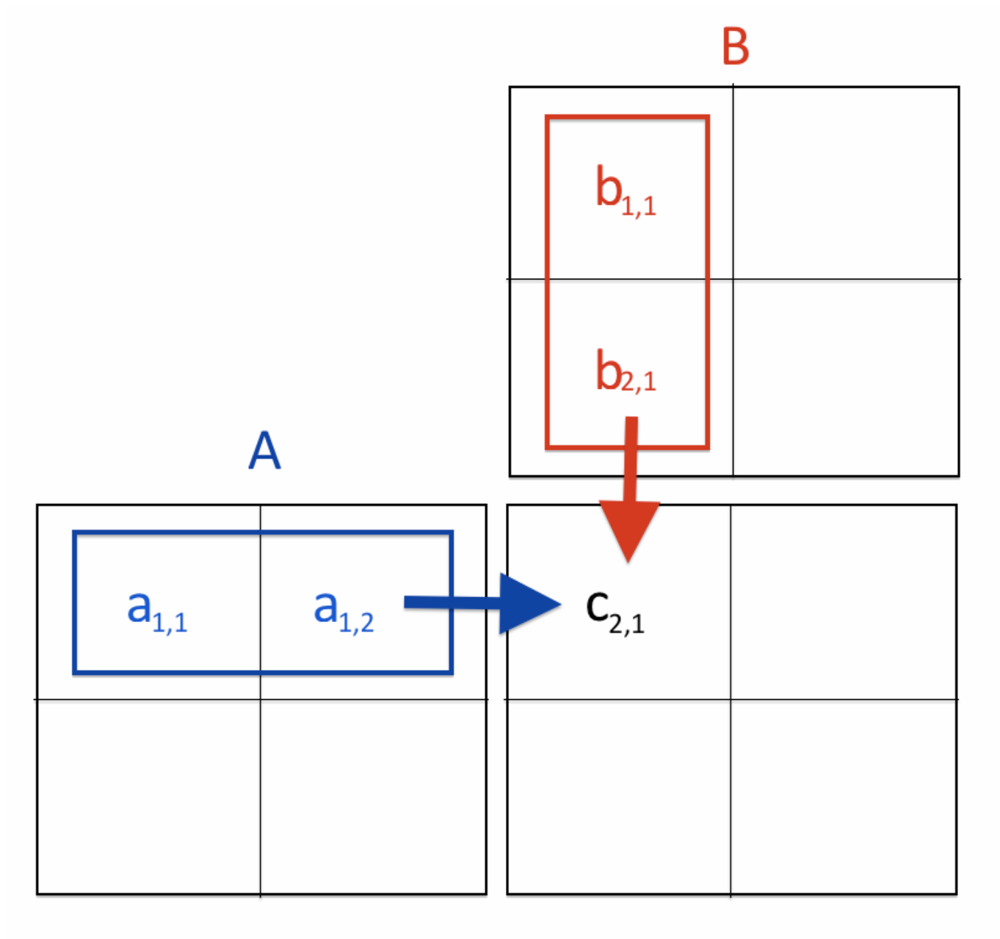
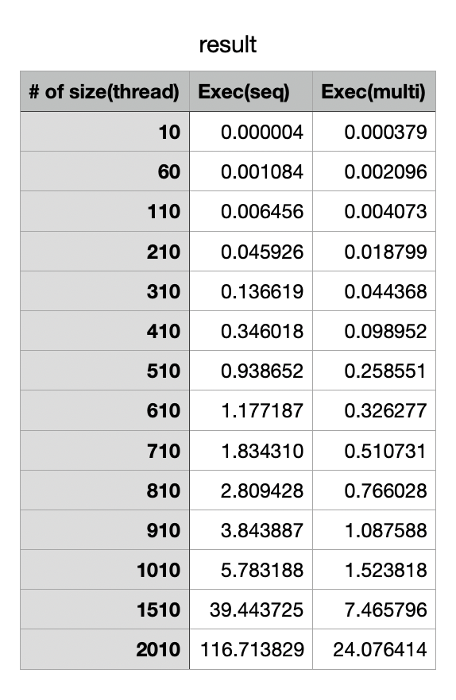
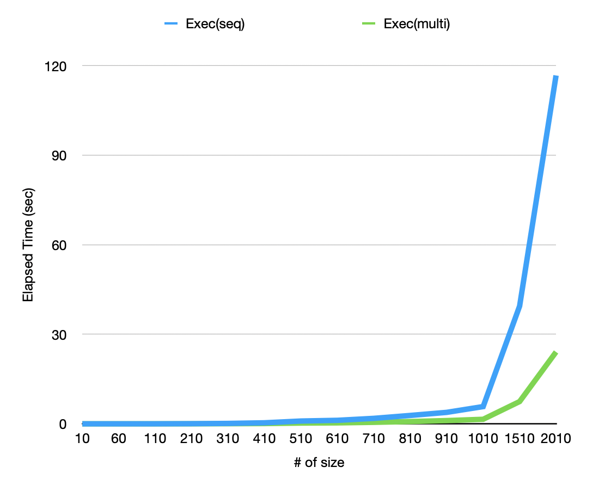

# Matrix Multiplication



```c
#include <bits/stdc++.h>
using namespace std;

// maximum size of matrix
#define MAX 4

// maximum number of threads
#define MAX_THREAD 4

int matA[MAX][MAX];
int matB[MAX][MAX];
int matC[MAX][MAX];
int _matC[MAX][MAX];
int step_i = 0;

void serial_multi()
{
	for (int i = 0; i < MAX; i++)
		for(int j = 0; j < MAX; j++)
			for(int k = 0; k < MAX; k++)
				_matC[i][j] += matA[i][k] * matB[k][j];
}

void* multi(void* arg)
{
	int core = step_i++;
	
//	long tid;
//	tid = (long)arg;
//	cout << endl << tid << endl;
	// each thread computes 1/4th of matrix multiplication
	for (int i = core * MAX / 4; i < (core + 1) * MAX/4; i++)
		for(int j = 0; j < MAX; j++)
			for(int k = 0; k < MAX; k++)
				matC[i][j] += matA[i][k] * matB[k][j];
	
}

int main()
{
	// generating random values in matA and matB
	for (int i = 0; i < MAX; i++){
		for (int j = 0; j < MAX; j++){
			matA[i][j] = rand() % 10;
			matB[i][j] = rand() % 10;
		}
	}

	cout << endl << "Matrix A" << endl;
	for (int i = 0; i < MAX; i++){
		for (int j = 0; j < MAX; j++)
			cout<< matA[i][j] << " ";
		cout << endl;
	}

	cout << endl << "Matrix B" << endl;
	for (int i = 0; i < MAX; i++){
		for (int j = 0; j < MAX; j++)
			cout<< matB[i][j] << " ";
		cout << endl;
	}

	// declaring 4 threads
	pthread_t threads[MAX_THREAD];

	// creating 4 threads, each evaluating its own part
	long i;
	for (i = 0; i < MAX_THREAD; i++){
		int* p;
		pthread_create(&threads[i], NULL, multi, (void*)(p));
	//	pthread_create(&threads[i], NULL, multi, NULL);
	}

	// joining and waiting for all threads to complete
	for (int i = 0; i < MAX_THREAD; i++)
		pthread_join(threads[i], NULL);

	// displaying the result matrix
	cout << endl << "Multiplication of A and B" << endl;

	for (int i = 0; i < MAX; i++){
		for (int j = 0; j < MAX; j++)
			cout << matC[i][j] << " ";
		cout << endl;
	}

	cout << endl;
	serial_multi();
	cout << endl << "Serial_Multiplication of A and B" << endl;
	for (int i = 0; i < MAX; i++){
		for (int j = 0; j < MAX; j++)
			cout << _matC[i][j] << " ";
		cout << endl;
	}
	
	return 0;
}
```


What happend to this code?

Result is not correct and also elapsed time is... hmmm

Technically function using pthread should be less time...but serial is fast here.

Why is that?

[Multiplication of Matrix using threads - GeeksforGeeks](https://www.geeksforgeeks.org/multiplication-of-matrix-using-threads/)

Actually this code from above link didn't consider global variable, in other words in this chapter I'll call race-condition. This program runs in parallel, so we need to make "critical-section" to avoid compete between threads. Global variable, it must be targeted in midst of operations and it would be changed without control. Therefore we must change this code!

# So I correct this ...

Please visit my git if you want to see whole code.

[RuachKim/PlayGround](https://github.com/RuachKim/PlayGround/tree/main/Thread/MatMult)

**test_m.c**

```c
		// Main function //
		// pass the index of threads as an argument of pthread_create()
		for(i = 0; i < NTHREADS; i++) {
        rc = pthread_create(&threads[i], NULL, worker, (void *)i);
        assert(rc == 0);
    }

    for(i = 0; i < NTHREADS; i++) {
        rc = pthread_join(threads[i], NULL);
        assert(rc == 0);
    }
```

```c
void mm(int tid)
{
    int i, j, k;
    int start = tid * SIZE/NTHREADS;
    int end = (tid+1) * (SIZE/NTHREADS) - 1;

    for(i = start; i <= end; i++) {
        for(j = 0; j < SIZE; j++) {
            C[i][j] = 0;
            for(k = 0; k < SIZE; k++) {
                C[i][j] += A[i][k] * B[k][j];
            }
        }
    }
}

void *worker(void *arg)
{
    int tid = (int)arg;
    mm(tid);
}
```

At this point, we would  have a curiosity... would it be powerful if we use Thread in the program?

The answer is case by case.

But Surely in this project "Matrix Multiplication" It is very "POWERFUL".

Below is the graph to compare between Thread and Sequential method.





You can find how Thread is efficient when it comes to Matrix Multiplication. **The elapsed time is way shorter than sequential one as the size of matrix goes higher.**

> **CAREFUL!**  Use gettimeofday( ) to measure execution time in multi-programming. Other API such as clock( ) is not suitable because it brings out the total elapsed time of each thread.
